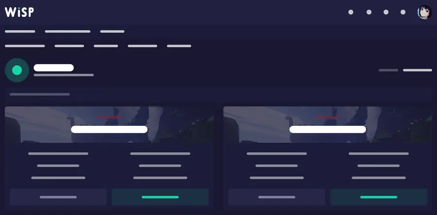

# Wisp MCP — connect a WISP game panel to AI

**English · [Français](README.fr.md)**

Wisp MCP is a source-available Model Context Protocol server for the **WISP game panel Client API**. It lets MCP-compatible AI clients inspect and manage game servers through the panel instead of giving the AI unrestricted access to the host machine.

It is **hosting-provider agnostic**. If your hosting company gives you a WISP panel and a Client API token, use that panel URL. No provider-specific code path is required.

[](https://github.com/BreezeDelegate/wisp-mcp/actions/workflows/ci.yml)
[](https://github.com/BreezeDelegate/wisp-mcp/releases/latest)
[](https://www.python.org/)
[](https://registry.modelcontextprotocol.io/?q=io.github.BreezeDelegate%2Fwisp-mcp)

**Start with the visual guide:** https://breezedelegate.github.io/wisp-mcp/

## Do I have a WISP panel?

If your game-server panel looks like this, it is likely WISP:



*Typical WISP client dashboard. Hosts can white-label WISP, so colors, logo and domain may differ.*

If you are unsure, ask your host: **“Does my server use WISP, and can I create a WISP Client API token?”** See [How to recognize WISP](docs/panel-recognition.md).

## What it can do

- inspect server state, CPU, memory, disk and network usage;
- browse paginated directories, read configs and tail logs;
- search large files and read bounded chunks without flooding the model context;
- create files, or safely edit existing plugin/config files with SHA-256 change detection;
- send console commands;
- start, stop and restart servers;
- create and inspect backups;
- manage databases when enabled;
- inspect audit logs and common panel state;
- run locally with **stdio** or remotely with **Streamable HTTP**;
- keep destructive operations behind a separate capability switch.

Because it targets WISP rather than one game, the same MCP can be used with **Rust, Minecraft and other game servers managed by WISP**.

## Install on a Linux VPS

For Debian 12 or Ubuntu 24.04+:

```bash
curl -fsSL https://raw.githubusercontent.com/BreezeDelegate/wisp-mcp/main/install-vps.sh | sudo bash
```

The installer asks for:

1. the WISP panel URL supplied by your host;
2. an optional default server ID;
3. your WISP Client API token in a hidden terminal prompt.

It creates a dedicated system user, stores credentials outside Git, and runs `wisp-mcp doctor` before reporting success.

For a deeper read-only API compatibility check, run `wisp-mcp compatibility`. It verifies the minimal response contract used by the MCP without modifying the game server.

For **ChatGPT**, install the OpenAI tunnel helper at the same time:

```bash
curl -fsSL https://raw.githubusercontent.com/BreezeDelegate/wisp-mcp/main/install-vps.sh | sudo bash -s -- --with-openai
```

## Connect your AI client

Wisp MCP is not tied to one model vendor. It implements standard MCP transports.

### ChatGPT

Use OpenAI Secure MCP Tunnel for an always-on private VPS, then add the MCP as a custom app in ChatGPT Developer Mode. See [ChatGPT setup](docs/chatgpt.md).

### Claude Code

Claude Code can launch Wisp MCP directly. If Wisp MCP is on a remote VPS, use SSH as the stdio command:

```bash
claude mcp add --scope user wisp -- ssh user@your-vps /usr/local/bin/wisp-mcp-stdio
```

Then verify:

```bash
claude mcp get wisp
```

### Other MCP clients

Use one of the standard transports:

- **stdio**: `/usr/local/bin/wisp-mcp-stdio` or an SSH command that launches it remotely;
- **Streamable HTTP**: `wisp-mcp serve` behind authentication and a secure network boundary;
- **MCP Bundle**: download the `.mcpb` artifact from the latest release if your client supports bundles.

See [AI client compatibility](docs/clients.md).

## Local quick start

Requirements: Python 3.11+ and a WISP Client API token.

```bash
git clone https://github.com/BreezeDelegate/wisp-mcp.git
cd wisp-mcp
./setup.sh
```

Or inside an existing Python environment:

```bash
python -m pip install .
wisp-mcp init
wisp-mcp doctor
wisp-mcp
```

## Configuration

Required values:

```env
WISP_PANEL_URL=https://panel.example.com
WISP_API_TOKEN=your_token
```

Optional default server:

```env
WISP_SERVER_ID=ABCDEFGH
```

Write capabilities are opt-in:

```env
WISP_ALLOW_COMMANDS=true
WISP_ALLOW_FILE_WRITES=true
WISP_ALLOW_POWER=true
WISP_ALLOW_BACKUPS=true
WISP_ALLOW_DATABASES=false
WISP_ALLOW_SERVER_SETTINGS=false
WISP_ALLOW_DESTRUCTIVE=false
```

Keep `WISP_ALLOW_DESTRUCTIVE=false` during normal administration. File deletion, backup restore/delete, database deletion/password rotation, force-kill and panel update actions require the separate destructive gate.

## AI-guided setup

For a beginner, copy this into an MCP-capable assistant:

```text
Help me install Wisp MCP from https://github.com/BreezeDelegate/wisp-mcp. Read the current repository documentation first and reply in my language. First help me confirm that my game host uses the WISP panel. Then guide me one step at a time and do as much of the technical work as possible. Never ask me to paste API tokens, passwords, private keys, or tunnel runtime keys into chat; tell me exactly where to enter secrets directly in the terminal or provider UI. Use the smallest sensible Linux VPS if I need an always-on machine. Verify the WISP connection with wisp-mcp doctor before connecting my AI client. Start read-only, enable only the capabilities I need, keep destructive operations disabled by default, back up before risky changes, and verify status and logs after every change.
```

See [AI-guided setup](docs/ai-guided-setup.md) and [VPS sizing](docs/vps.md).

## Distribution and discovery

Wisp MCP is published in the **official MCP Registry** as `io.github.BreezeDelegate/wisp-mcp`.

Releases include:

- Python wheel;
- source archive;
- `.mcpb` MCP Bundle.

Registry publishing is automated from signed GitHub release workflows using OIDC.

## Large files and safe edits

For large source files or logs, start with bounded tools to locate the relevant code, but **do not optimize away context needed for correctness**. If a change depends on global state, distant hooks, shared classes, control flow, or interactions across the file, read the complete file even if it costs more tokens.

- `find_in_file` returns small line-numbered excerpts around literal matches;
- `read_file_chunk` returns a bounded character range plus `next_offset_chars`;
- `file_fingerprint` returns SHA-256, byte, character, and line counts without returning content.

Regular `read_file` responses also include a SHA-256 fingerprint. For existing files, use that fingerprint with:

- `safe_write_file` for a deliberate whole-file replacement;
- `replace_in_file` for a small exact replacement inside a large file.

Both guarded write tools re-read the file before writing and verify the stored content afterward. This is optimistic concurrency rather than an atomic filesystem lock, because the WISP Client API does not expose a compare-and-swap write primitive through this integration.

Listings for servers, directories, backups, databases, and audit logs support bounded pagination so clients do not need to load an unbounded collection at once.

## Security model

API and MCP tokens are never returned by tools. Remote HTTP fails closed unless authentication is configured. File paths and object IDs are validated, writes are bounded, and changing capabilities are opt-in.

The server also publishes operating instructions to MCP clients: inspect first, back up before risky changes, make the smallest change, then verify status and logs.

Report security issues privately as described in [SECURITY.md](SECURITY.md).

## Documentation

- [Visual beginner guide](https://breezedelegate.github.io/wisp-mcp/)
- [Getting started](docs/getting-started.md)
- [How to recognize a WISP panel](docs/panel-recognition.md)
- [Connect ChatGPT, Claude Code and other MCP clients](docs/clients.md)
- [ChatGPT / OpenAI Secure MCP Tunnel](docs/chatgpt.md)
- [VPS sizing](docs/vps.md)
- [Operations and security](docs/operations.md)
- [AI-guided setup](docs/ai-guided-setup.md)

## FAQ

### Is this tied to a hosting company?

No. The integration targets the standard WISP Client API. Use the panel URL and Client API token provided by whichever host runs your WISP panel.

### Is this tied to Rust or Minecraft?

No. It manages the game-server environment exposed by WISP, so the same integration can be used for different games.

### Does every AI app work with it?

No. The AI app must support Model Context Protocol. Wisp MCP supports the standard stdio and Streamable HTTP deployment patterns, which makes it compatible with common MCP clients without vendor-specific server code.

### Can it modify my server?

Only when the relevant capability is enabled. Read-only is the default, and destructive operations have a separate switch.

## License

Wisp MCP is distributed under the [PolyForm Noncommercial License 1.0.0](LICENSE). Commercial licensing requires separate permission from the copyright holder.
