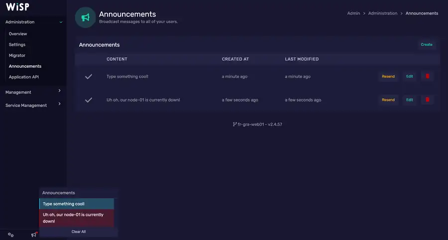

# Is my game panel WISP?

Wisp MCP works with the **WISP game panel Client API**, regardless of which hosting company provides the panel.

## Visual check

This is an official WISP interface example:


*Screenshot served by the official WISP website. Your host may change colors, logo, domain, or other branding.*

WISP supports white-label/custom branding, so a different logo does not prove that your host uses another panel.

## Reliable check

If the interface looks similar but you are unsure, ask your hosting provider one simple question:

> Does my game server use the WISP game panel and can I create a WISP Client API token?

If the answer is yes, Wisp MCP should use the panel URL supplied by that host and a Client API token created in your own account.

Example configuration:

```env
WISP_PANEL_URL=https://panel.example.com
WISP_API_TOKEN=your_token
```

Do not paste the token into an AI conversation. Enter it directly in the setup wizard, terminal, or MCP client secret field.

## Visual examples

### Client dashboard


### Administration area



Hosts can customize the branding, so use layout and panel terminology as clues rather than expecting an exact visual match.
